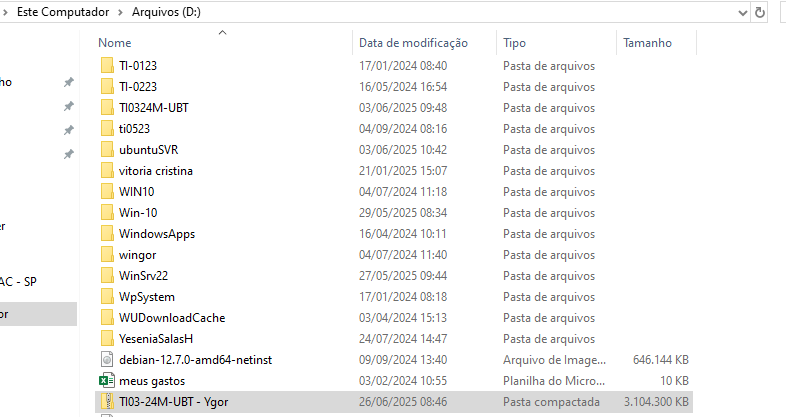
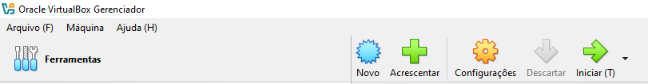
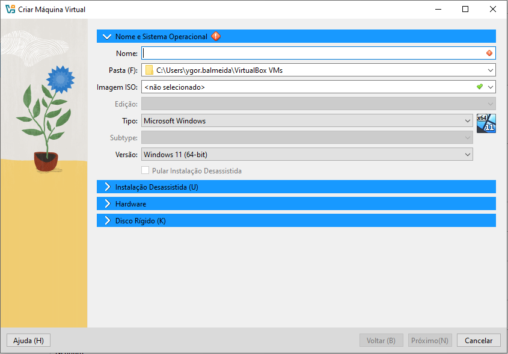

# Preparação de Ambiente.
criar máquina virtual para a instalação de ferramentas e dependências para o estudo de algoritimo e lógica e programação.
# Criar Doretório Base.
Crie um diretório para guardar a máquina virtual. No Drive D: crie uma nova pasta (nomeada com o nome do usuário).

# Preparação da Máquina Virtual.
Instale o APP da máquina virtual, (Oracle VirtualBox). Faça o Download no link fixado.
<a href="https://www.virtualbox.org/wiki/Downloads"> Faça o Download aqui.</a>
# Configuração da Máquina Virtual.
Após a instalação, abra o aplicativo da máquina virtual. Crie uma máquina clicando em novo.

Coloque um nome para sua máquina (Dependendo da sua preferência).

